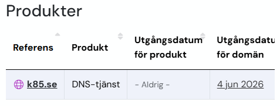
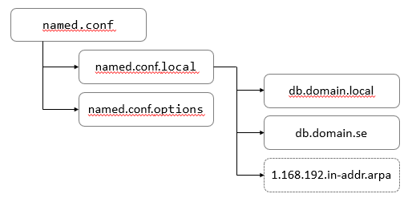

# Setup bind9

## Bakgrund

DNS-tjänster kan uppfylla minst en av tre olika scenarier.

1. **Internet DNS** eller DNS-tjänst på Internet (på WAN) som pekar ut din personliga server (på LAN). I texten benämnd som ```domain.se```. Exempelvis ```ftp.domain.se```.
2. Lokal DNS som upplöser namn till IP lokalt. Oftast används domännamnet ```home.local```, exempelvis ```nas.home.local```.
3. Split Horizon (eller *Split DNS*) Båda ovanstående scenarier samtidigt

## 1. Internet DNS

Denna tjänst ger möjlighet att från internet ange domänadresser som pekar till ett lokal nät. Det kan t.ex. vara att nå en webbserver, en FTP eller någon annan lokal service. För att detta ska fungera krävs att ha en domänadress. 

Min approach är att registera en .se-adress. Den blir personlig och lätt att komma ihåg. Tips är också att hålla den så kort som möjligt kort vilket innebär effektiva adresser om man ska uppge dessa ofta. 

[Återförsäljare för .se-adresser](https://internetstiftelsen.se/domaner/registrera-ett-domannamn/aterforsaljare/)

Sök därefter upp en fri tjänst på Internet som låter dig administrera DNS-poster själv. Ett sådant är *simply.com*. Om man bara är ute efter att hantera DNS på Internet så är *Simply.com* gratis och låter för tillfället att göra detta på livstid, utan att ens registera ditt kontokort. Anvisningar följer därför för just *Simply.com*.



| Referens | Produkt | Utgångsdatum för produkt | Utgångsdatum för domän |
| ---- | --- | --- | --- |
| aktuell domän | DNS-tjänst | - Aldrig - | 4 jun 2026 |

Notera kolumn 3 och 4. Kolumn 3 beskriver tjänsten hos *Simply.com*. Kolumn 4 är *Utgångsdatum för domän* dvs förfallodatum hos Internetstiftelsen som är registrator för .se-adresser. Man kan registera domän och betala för 12-120 månader. Efter domaännamnet förfallit får den i 10 dagar status *Expired* och blir efter det tillgänglig för vem som helst. 

På kontrollpanelen i *Simply.com* klicka ```Hantera DNS-inställningar för din domän```. 


Registrerade poster i DNS kan ta allt från 5-60 minuter att slå genom i hela världen, om du därför använder Google's DNS Servrar, ha tålamod.

Notera också att många personliga internettjänster bygger på dynamiska IP-adresser. Din router's WAN-adress är oftast dynamiskt tilldelad och kan byta adress vid t.ex. varje strömavbrott på routern. Den enkla lösningen vid ny WAN-IP är att ersätta denna med den nya i kontrollpanelen, men den rekommenderade lösningen på detta är att låta en klient på ditt nätverk, t.ex en Linux enhet köra ett CRON-jobb var 15:e minut...

```touch /path/to/ddns.sh```

```sudo nano /path/to/ddns.sh```

Addera följande till ddns.sh och spara

```curl -s -u "ACCOUNTNAME:APIKEY" "https://api.simply.com/2/ddns/?domain=example.com&hostname=home.example.com"```

*Accountname* och *APIKEY* finns under Allmänn information i kontrollpanelen hos *Simply.com*. 

Sätt exekveringsrättigheter

```sudo chmod +x /path/to/ddns.sh```

Första gången crontab körs skapas en fil. Ubuntu 22.04 användare behöver välja texteditor. Välj ```nano```

```crontab -e```

Skriv in nedanstående och spara

```*/15 * * * * /path/to/script.sh > /dev/null 2>&1```

Lista cronjob

```crontab -l```


Sista steg är att göra *Port Forwarding* på din router. Detta är en WAN-inställning och betyder att respektive förfrågan från Internet vidarebefordras till rätt TCP-port. Om man söker ```www.domän.se``` så använder protokollet HTTP standardporten 80. Om en webbserver finns i det lokala nätverket på IP-adress 192.168.1.40 så ska alltså följande inställning göras på din router...

| Service name | External Port | Internal Port | Internal IP Address | Protocoll | 
| --- | --- | --- | --- | --- |
| WEB* | 80 | 80 | 192.168.1.40 | TCP |

*valfritt

[Övriga TCP-portar enligt standard](https://www.iana.org/assignments/service-names-port-numbers/service-names-port-numbers.xhtml)

## 2. Lokal DNS

## Installera BIND9 (de facto standard)

* Förutsättningar: samtliga instruktioner gäller linux, främst Ubuntu. 
* Hårdvara: RPI (Debian), PC (Ubuntu Server)

```sudo apt install bind9```

## Översikt - konfigurationer

Alla konfigurationer ligger i...

```/etc/bind```

Kopplingarna framgår av bilden. Pilen pekar mot referens



## named.conf

Detta är den primära konfigurationen för BIND. Behöver inte ändras.

```bash
include "/etc/bind/named.conf.options";
include "/etc/bind/named.conf.local";
include "/etc/bind/named.conf.default-zones";
```

## named.conf.options

Allmän konfigureringsfil som...

* port att lyssna på
* tillåtna uppslag
* DNSSEC
* cashe filväg
* etc...

Ett exempel

```bash
acl internal-network {
  192.168.1.0/24;
};

options {
    directory "/var/cache/bind";

    recursion yes;
    allow-query { any; };
    allow-recursion { internal-network; localhost; };
    allow-transfer { none; };

    forwarders {
        8.8.8.8; // Google DNS
        8.8.4.4;
    };


    dnssec-validation auto;
    listen-on { any; };
    listen-on-v6 { any; };
};
```

2 
